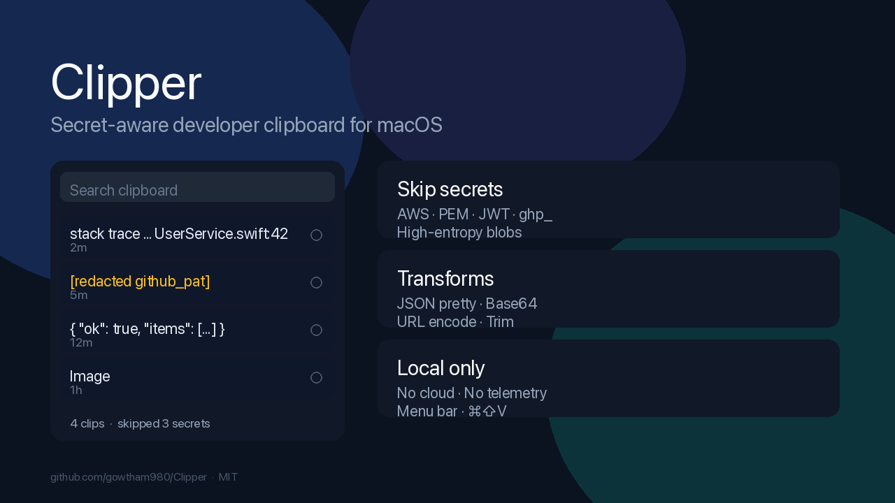

# Clipper

**Secret-aware developer clipboard for macOS** — local menu-bar history that can refuse credentials and transform clips before you paste.



## Why Clipper

Most clipboard managers either store everything in plaintext (including keys you copied from Slack or a terminal), charge for iCloud pinboards, or grow into a kitchen sink. Clipper stays small:

- Honors **concealed / transient** pasteboard flags
- **Skips or redacts** high-confidence secrets (AWS keys, PEM, JWT, GitHub `ghp_` / `github_pat_`, high-entropy blobs)
- **Transforms** a clip (JSON pretty, Base64, URL encode/decode, trim) from the context menu
- Keeps **text + images** on disk under Application Support — no cloud, no telemetry

## Requirements

- macOS 13 Ventura or later
- Building from source: Xcode 15+ / Swift 5.9+

## Install

### Build from source (current recommended path)

There is **no notarized App Store-style release for this secret-aware rewrite yet**. Older GitHub tags (`v1.0.x`) predate this work and are plain history-only builds.

```bash
git clone https://github.com/gowtham980/Clipper.git
cd Clipper
swift build -c release
swift run
```

Or package an ad-hoc `.app` / `.dmg` (Gatekeeper will warn until you notarize on your own account):

```bash
./scripts/build-app.sh 0.2.0
```

**Bypass a one-time Gatekeeper warning** if needed:

```bash
xattr -dr com.apple.quarantine /path/to/Clipper.app
```

Or right-click → **Open** → **Open**, or **System Settings → Privacy & Security → Open Anyway**.

### Direct download

Check [Releases](https://github.com/gowtham980/Clipper/releases) for whatever is published. Prefer building `main` until a signed 0.2.x (or later) tag exists.

## Usage

1. Launch Clipper — a clipboard icon appears in the menu bar (`LSUIElement`, no Dock icon).
2. Copy text or an image anywhere on the Mac.
3. Press **⌘⇧V** (or click the icon) to open history. Search, pin, delete, or click a row to re-copy (popover closes).
4. Right-click a text row → **Transform** for JSON pretty / Base64 / URL / trim.
5. **Settings…** in the footer: hotkey, secret policy, ignore apps, history limit, launch at login.

History file: `~/Library/Application Support/Clipper/history.json`  
Images: `~/Library/Application Support/Clipper/images/`

## Use cases

1. **Recover the snippet** — You copied a URL, then a token, then a stack trace. Hit ⌘⇧V, search `error` (or `UserService`), click the trace, paste into the issue tracker.
2. **Do not keep the key** — You copy a `ghp_` or `AKIA…` key. With default **Skip secrets**, history does not store it; the footer shows `skipped N secrets` for the session. Switch to **Redact** if you want a placeholder row instead.
3. **Pretty-print JSON** — Copy a minified API payload, right-click → Transform → JSON pretty-print, paste into your editor. Invalid JSON shows an in-popover error instead of crashing.
4. **Ignore the password manager** — 1Password / Bitwarden / LastPass / Dashlane / Apple Passwords bundle IDs ship in the default ignore list so vault copies never enter history.

## Why not X?

| Tool | When to use it | Why Clipper is different |
|------|----------------|--------------------------|
| **Maccy** | Fast keyboard-first history; category default | Clipper adds a **visible secret policy**, developer **transforms**, and image history in a simple popover — not a Maccy UI clone. Maccy still persists ordinary plaintext secrets unless you carefully ignore sources. |
| **Paste** | Polished pinboards + iCloud | Clipper is **local-only** and free/MIT. No subscription, no clipboard in the cloud. |
| **Deck** | OCR, semantic search, LAN sync, huge surface | Clipper is intentionally **small and auditable** — policy + transforms, not a kitchen sink. |

## Development

```bash
swift build
swift test    # XCTest on Swift 5.9 (SecretDetector, transforms, history limit)
```

Layout (see also design notes in the open-source-solver cycle):

```
Sources/Clipper/
  App.swift
  StatusItemController.swift
  Models/ClipItem.swift
  Clipboard/   # store, policy, SecretDetector, transforms, settings
  Views/       # popover, row, settings
Tests/ClipperTests/
scripts/build-app.sh
scripts/generate_project_image.py
```

Default secret mode is **skip**. Pin does not re-copy. History trimming drops oldest **unpinned** items first and preserves newest-first order.

## Privacy

- Everything stays in your user Application Support folder.
- No analytics, accounts, or network calls from the app.
- Secret detection is heuristic — not a guarantee. Prefer OS concealed flags + ignore lists + skip mode together.

## License

MIT — see [LICENSE](LICENSE).
